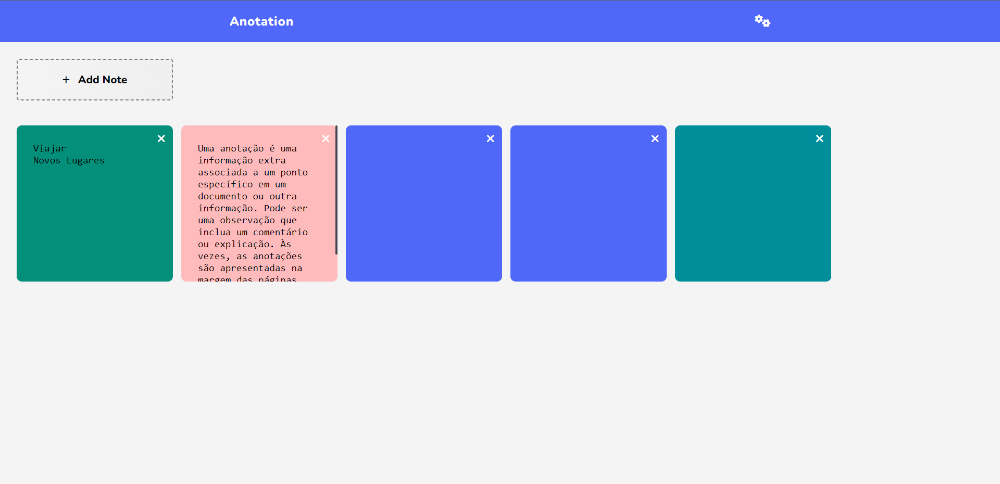

 

    
    
  <h3 align="center">Anotações JS</h3>
  
  

    Projeto para estudos feito em HTML - CSS - JS  

  

## Índice

- [Update](#update) - Ainda por fazer
- [Techs](#techs)
- [Cores](#cores)
- [Tipo de fonte](#tipo-de-fonte)

# Update: (Ainda por fazer)

- Finalização da responsividade
- Adição de novos recursos no template
- Páginas secundárias 

# Techs:

- HTML
- CSS
- JS

## Cores:

    --color-primary: #5463FF;
    --color-secondary: ;
    --color-bg: #f4f4f4;
    --color-white: #ffffff;
    --color-gradient-bg: linear-gradient(90deg,#F4F4F4 0%,#EFEFEF 100%);

## Tipo de fonte:

  font-family: 'Nunito', sans-serif;